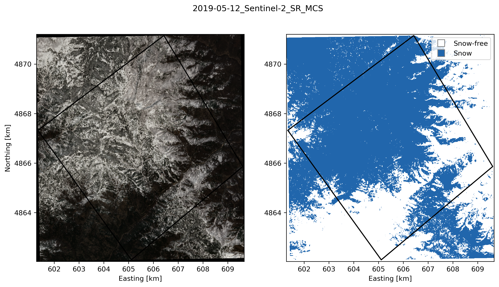

# ndsi-snow-maps

Workflow to classify snow by thresholding the Normalized Difference Snow Index (NDSI) in Landsat 8/9 and Sentinel-2.
Images are accessed via Google Earth Engine.

Rainey Aberle (raineyaberle@u.boisestate.edu)

### Requirements:
- Geospatial file of the site boundaries (shapefile, geopackage, or other file readable by geopandas)
- Google Earth Engine account

### Installation:
Fork and/or clone this GitHub repository. We recommend installing the required packages using `mamba` or `conda` by running the following command:

`mamba env create -f environment.yml`

Run the snow mapping pipeline using the `ndsi_snow_mapping.ipynb` notebook.

### Example results:

