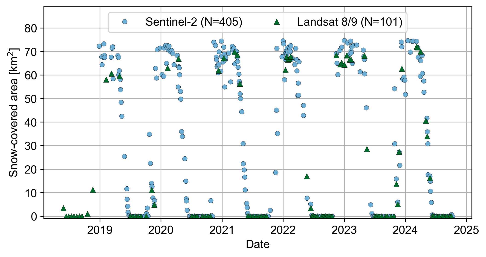

# ndsi-snow-maps

Simple workflow to classify snow by thresholding the Normalized Difference Snow Index (NDSI) in Landsat 8/9 and Sentinel-2.

## Correspondence
Rainey Aberle (raineyaberle@u.boisestate.edu)

## Requirements:
- Geospatial file of the site boundaries (shapefile, geopackage, or other file readable by geopandas)
- Google Earth Engine account. Sign up for free [here](https://code.earthengine.google.com/register).

## Installation:
Fork and/or clone this GitHub repository. We recommend installing the required packages using `mamba` or `conda` by running the following command:

`mamba env create -f environment.yml`

## Image processing workflow
Run the snow mapping pipeline using the `ndsi_snow_mapping.ipynb` notebook. Utility functions for image processing can be found in `functions.py`. The basic image processing steps are as follows. For each image dataset, Landsat 8/9 and Sentinel-2:

1. Query Google Earth Engine for all images in the specified date range covering the user-defined area of interest. If images are larger than the Google Earth Engine user memory limit, they must be tiled and downloaded locally using the [geedim](https://geedim.readthedocs.io/en/latest/index.html) package. Otherwise, they are downloaded in temporary memory and converted to xarray format using the [wxee](https://wxee.readthedocs.io/en/latest/) package. 
2. Mask clouds in each image using geedim. 
3. Mosaic images captured the same day to increase spatial coverage where applicable. 
4. Optional: Filter images with less than a user-speficied percent coverage of the area of interest after cloud masking and mosaicking. 
5. Calculate the Normalized Difference Snow Index (NDSI) using the green and shortwave infrared bands. 
6. Classify snow by thresholding the NDSI (default threshold = 0.4).
7. Save the output snow masks. 

## Example results:
Results at Mores Creek Summit, Idaho for 2018–2024. The top figure shows a Sentinel-2 Surface Reflectance image captured on 2019-05-12 (left) and the resulting snow cover map (right). The black box indicates the area of interest used to query imagery. Bottom figure shows the resulting snow-covered area time series. 

